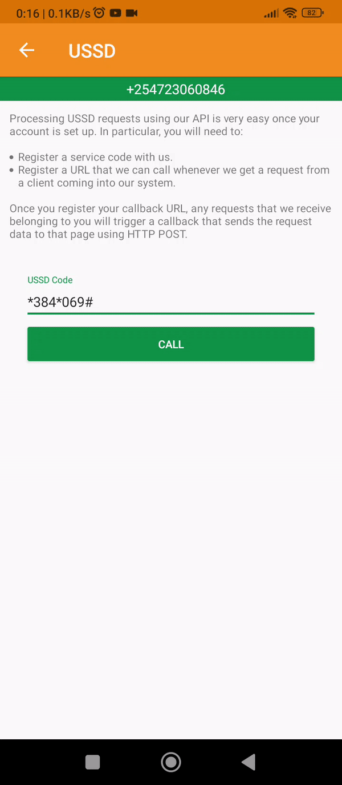
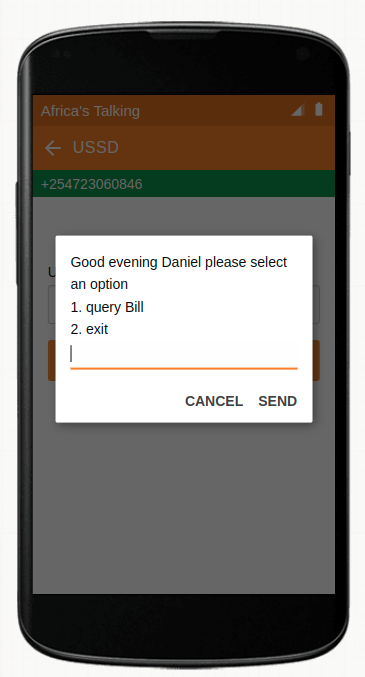
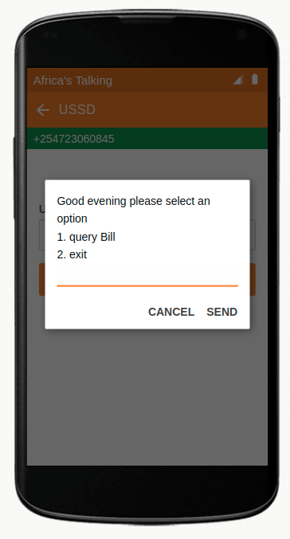
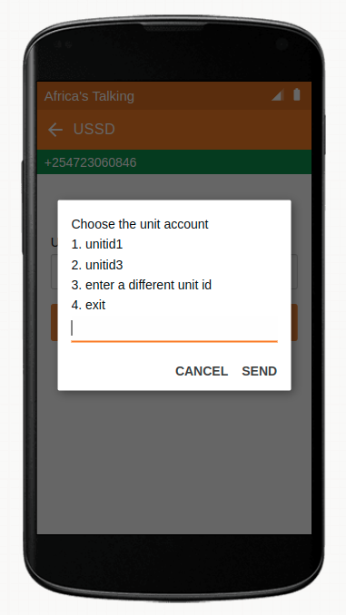
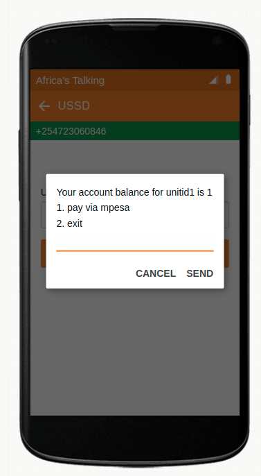
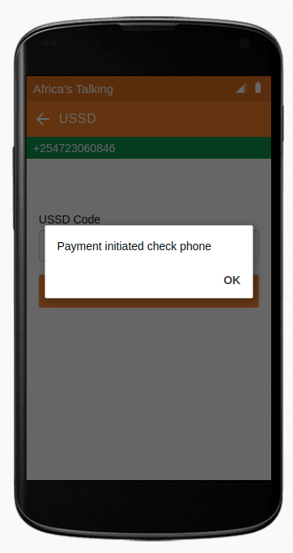
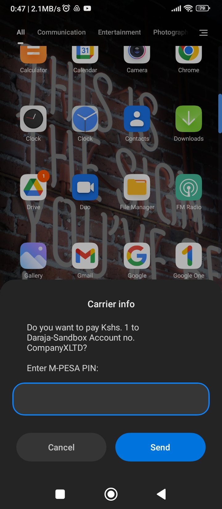

<h1 align="center"><b>USSD STK-Push pipeline
</b></h1>

[](https://github.com/DanNduati/ussd-stkpush)

## <b>Description</b>
Implemention of a ussd -> stk-push mobile payment pipeline with Fastapi, AT-USSD and M-Pesa Express API
## <b>Demo</b>
<p align="center">
</img>
</p>

## <b>Prerequisites</b>
- Python3
- [Safaricom Developers Account](https://developer.safaricom.co.ke/)
- [M-Pesa Express documentation summary](stkpush.md)
- [Africa's Talking documentation summary](https://github.com/DanNduati/at-ussd/blob/main/AT-USSD.md)

## <b>Running locally</b>
### clone the repository and navigate to the project directory
```bash
git clone git@github.com:DanNduati/ussd-stkpush.git
cd ussd-stkpush/
```
### Create a python virtual environment activate it
```bash
python3 -m venv venv
source venv/bin/activate
```
### Install Project dependencies
```bash
pip install -r requirements.txt
```
Create a `.env` file similar to [`.env.example`](.env.example).

### Run uvicorn server
```bash
uvicorn app.main:app --reload
```
### Run ngrok tunneling script
```bash
cd scripts
./start_ngrok.sh
```
This should print out your tunnel address and also populate it into your .env file
```bash
$ ./start_ngrok.sh 
Extracting ngrok public url ...
NGROK_PUBLIC_URL => [ https://d8eb-197-232-61-213.ngrok.io ]
```

## <b>Outcome</b>
<p align="center">

| Registered User                                          | Unregistered user                                          |
|----------------------------------------------------------|------------------------------------------------------------|
| </img>   | </img>   |
| </img>   | WIP                                                        |
| </img>   | WIP                                                        |
| </img>   | WIP                                                        |
| </img>          | WIP                                                        |

</p>

## <b>Inspiration</b>
NYEWASCO [ussd water bill enquiry and payment](http://www.nyewasco.co.ke/ussd-water-bill-enquiry/)

</img>

## <b>Technologies Used</b>

## <b>License</b>
[](LICENSE)